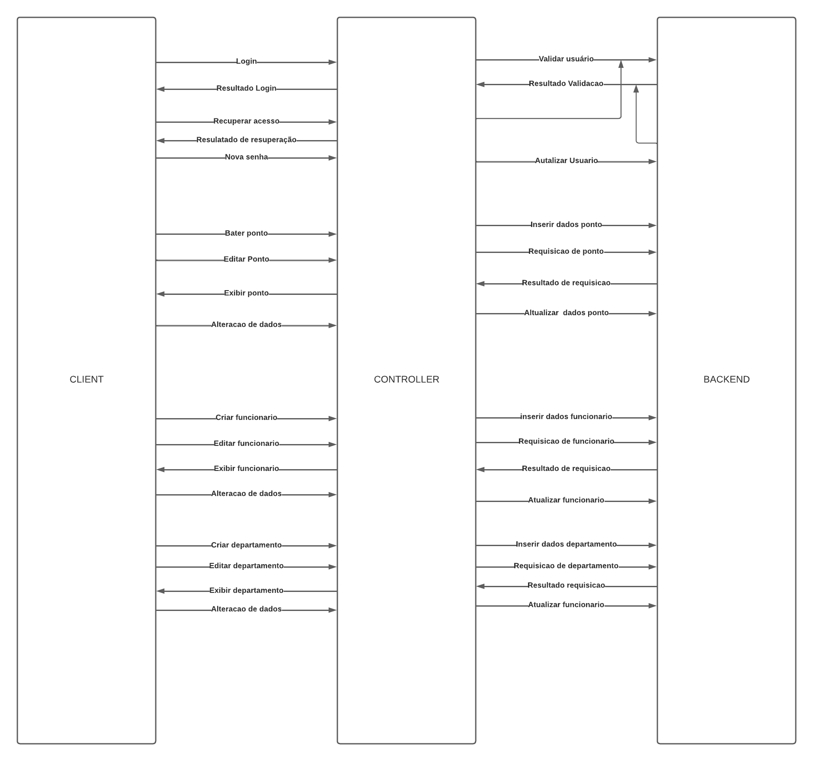

## Sumário

- [Sumário](#sumário)
- [Descrição](#descrição)
  - [**Histórico de Revisões**](#revisoes)
- [Visão Geral](#visao-geral)
- [Mecanismos arquiteturais](#mecanismos-arquiteturais)
  - [**Tecnologias**](#tecnologias)
- [Decisões de Design](#decisao-design)
- [Validação com Casos de Teste](#validacao-casos-teste)
- [Componentes](#componentes)
- [Implantação](#implantacao)
- [Referências](#referencias)

# Descrição

Este documento descreve a arquitetura proposta para o REPy (Registro Eletrônico de Pontos y), descrevendo os padrões arquiteturais utilizados, os requisitos não funcionais, os mercanismos arquiteturais, descrição das tecnologias utilizada, as decisões de design, as validações com os casos de teste, as responsabilidades de cada componente detalhada, o diagrama de componentes e área física em que serão implantados.

### **Histórico de Revisões**

| Data       | Versão | Descrição                                                              | Autor                           |
| :--------- | :----: | :--------------------------------------------------------------------- | :------------------------------ |
| 07/05/2023 |  1.0   | Criação do documento, descrição e sumário;  Marcelo |

### **Visão Geral**
A arquitetura do projeto seguirá o padrão Model-View-Controller(MVC). Essa arquitetura funciona da seguinte forma: 

+ ## Model
  É Responsável pelo acesso e manipulação de leitura e escrita dos dados na aplicação, nesse projeto o Nodejs tem a responsabilidade de manipular esses dados.
   
+ ## View
   É a camada responsável pela apresentação dos dados para o usuário, nesse projeto o ReactJS tem essa responsabilidade.
   
+ ## Controller
   Responsável por receber todas as requisições do usuário e fazer a ligação do model a view, orientando os fluxos de dados na aplicação, por exemplo, qual model será usado, qual view será exibida para o usuário.

### **Mecanismos arquiteturais**

| Mecanismo de Análise | Mecanismo de Design | Mecanismo de Implementação |
| --- | --- | --- |
| Front-End | Interface de comunicação com o usuário.  | ReactJS |
| Build  | Programação da IDE para validação do código fonte. | Visual Studio Code  |
| Deploy | Configuração da IDE de deploy.| Visual Studio Code |

### **Tecnologias**

1. React JS: Biblioteca JavaScript de código aberto com foco em criar interfaces de usuário em páginas web;
2. Visual Studio Code: IDE para de desenvolvimento;

### **Componentes**

### **Referências**
https://docs.google.com/document/d/1i80vPaInPi5lSpI7rk4QExnO86iEmrsHBfmYRy6RDSM/edit#
